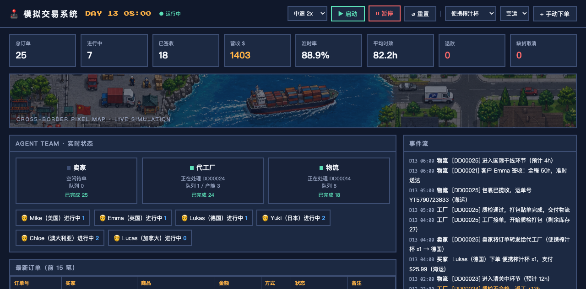

<div align="center">

# cross-border-dropshipping-sim

**Cross-Border Dropshipping Simulator · 跨境电商无货源代发仿真系统**


</div>

> An agent-based simulation of the cross-border e-commerce dropshipping supply chain — overseas buyers place orders, a zero-inventory domestic seller forwards them to a contract factory, and the factory ships directly to the customer worldwide. Rule-driven, deterministic-friendly, with a real-time pixel-style web dashboard.
>
> 基于多智能体（Multi-Agent）的跨境电商一件代发全流程仿真：海外买家下单 → 国内零库存卖家转发 → 代工厂打包 → 国际物流直发海外。规则驱动、可复现，带实时像素风可视化面板。



---

## What is this? · 这是什么

**Cross-Border Dropshipping Simulator** is a multi-agent simulation system that models the complete "zero-inventory dropshipping" (无货源一件代发) transaction loop used in cross-border e-commerce:

1. **Overseas buyers** place and pay for orders on the seller's cross-border store.
2. The **domestic seller** holds no inventory and forwards each paid order to a contract factory.
3. The **factory** performs QC, packs, and hands the parcel to international logistics.
4. **Logistics** ships the parcel (air or sea) through customs and last-mile delivery to the buyer's door.

The system simulates multi-buyer concurrent ordering, multiple SKUs, and realistic exception scenarios (out-of-stock restocking, QC rework, customs delays, overtime refunds), with live metrics for revenue, on-time rate, average fulfillment time, refunds, and cancellations.

典型用途：业务演示、流程培训、履约逻辑验证、教学实验。

## Features · 功能特性

- 🤖 **Agent Team 多智能体协作** — 6 buyer agents (US/UK/DE/JP/AU/CA), 1 seller agent, 1 factory agent (capacity-limited), 1 logistics agent (multi-stage transport)
- 📦 **Complete order lifecycle** — 11-state flow: `PAID → FORWARDED → ACCEPTED → QC → PACKED → SHIPPED → LINEHAUL → CUSTOMS → LAST_MILE → DELIVERED`
- ⚠️ **Exception simulation 异常场景** — out-of-stock restocking & cancellation, QC rework, customs inspection delays, buyer refund requests and seller approval/rejection
- 📊 **Live dashboard 实时看板** — total orders, active orders, delivered, revenue, on-time rate, average fulfillment hours, refunds, cancellations
- 🕹 **Pixel-style web UI 像素风面板** — real-time agent status, event stream, order table, factory stock, built with vanilla JS (no frontend build step)
- ⏱ **Accelerated simulation clock** — 1 tick = 1 simulated hour; 4 speed levels (1x–10x); start / pause / reset / manual order injection
- 🧪 **Headless-testable engine** — the simulation core (`simulation.py`) is a pure-Python module with zero web dependencies

## Architecture · 系统架构

```
┌─────────────────────────────────────────────────────────────┐
│  Browser (pixel dashboard, polls /api/state every 1s)        │
└──────────────────────────────┬──────────────────────────────┘
                               │ REST (FastAPI)
┌──────────────────────────────▼──────────────────────────────┐
│  app/main.py — API & static hosting                          │
│    GET  /api/state     simulation snapshot                   │
│    POST /api/control   start / pause / reset / speed         │
│    POST /api/order     manual order injection                │
└──────────────────────────────┬──────────────────────────────┘
                               │
┌──────────────────────────────▼──────────────────────────────┐
│  app/simulation.py — rule-driven engine (1 tick = 1 sim hour)│
│                                                              │
│   BuyerAgent ×6 ──order──▶ SellerAgent ──forward──▶ FactoryAgent │
│        ▲                                                │    │
│        │ refund                                   QC / pack    │
│        │                                                ▼    │
│        └────────── sign / refund ◀── LogisticsAgent ◀──┘    │
│                  (pickup → line-haul → customs → last-mile)  │
└──────────────────────────────────────────────────────────────┘
```


## Agent Roles · 智能体职责

| Agent | 角色 | Behavior rules 行为规则 |
|---|---|---|
| `BuyerAgent` | 海外买家 | Random ordering (~2%/h when < 2 active orders); air/sea choice; refund request when delivery exceeds ETA + patience (24–72h) |
| `SellerAgent` | 国内卖家 | Forwards paid orders to the factory (1 order/tick, zero-inventory online operation); approves refunds, rejects if already delivered |
| `FactoryAgent` | 代工厂 | Capacity 3 concurrent jobs; consumes SKU stock; out-of-stock → 30h restock production (2% cancellation); 3% QC failure → +12h rework |
| `LogisticsAgent` | 国际物流 | Pickup 2h → line-haul (air 12–24h / sea 96–160h) → customs 6–20h (12% inspection delay +48h) → last-mile 10–30h → signed |

## Quickstart · 快速开始

Requirements: Python 3.10+

```bash
git clone https://github.com/JingHao-Leon/cross-border-dropshipping-sim.git
cd cross-border-dropshipping-sim
python3 -m venv .venv
source .venv/bin/activate        # Windows: .venv\Scripts\activate
pip install -r requirements.txt
cd app
uvicorn main:app --host 127.0.0.1 --port 8360
```

Open **http://127.0.0.1:8360/**, then click **▶ 启动** to start the simulation.

### Headless engine test · 无头验证

The engine runs standalone without the web server:

```python
from simulation import Engine

e = Engine()
for _ in range(1500):      # 1500 ticks ≈ 62 simulated days
    e.tick()

s = e.snapshot()
print(s["metrics"])        # {'total_orders': 111, 'delivered': 98, ...}
```

## API Reference · 接口

| Method | Path | Description |
|---|---|---|
| `GET` | `/api/state` | Full snapshot: clock, metrics, agent status, recent orders, event stream, SKU stock |
| `POST` | `/api/control` | `{"action": "start"\|"pause"\|"reset", "speed": 0.1–2.0}` — seconds per tick |
| `POST` | `/api/order` | `{"sku": "SKU-01", "qty": 1, "method": "air"\|"sea", "country": "美国"}` — inject a manual order |

## Simulation Parameters · 仿真参数

Key tunables in `app/simulation.py`:

| Parameter | Default | Meaning |
|---|---|---|
| `FactoryAgent.CAPACITY` | 3 | Concurrent factory jobs |
| `FactoryAgent.RESTOCK_HOURS` | 30 | Out-of-stock restock production time |
| `FactoryAgent.QC_FAIL_RATE` | 0.03 | QC failure → +12h rework |
| `FactoryAgent.CANCEL_RATE` | 0.02 | Order cancellation when out of stock |
| `LogisticsAgent.CUSTOMS_DELAY_RATE` | 0.12 | Customs inspection delay (+48h) |
| `BuyerAgent.patience` | 24–72h | Overtime tolerance before refund request |
| `Engine.speed` | 0.5 | Real seconds per simulated hour |

## Use Cases · 适用场景

- **业务演示** — demonstrate the dropshipping loop without real stores, orders, or parcels
- **流程培训** — zero-risk onboarding for new e-commerce operations staff
- **履约逻辑验证** — validate fulfillment rules in a sandbox before production rollout
- **教学实验** — a compact, readable example of agent-based modeling and discrete-event simulation in Python

## Tech Stack · 技术栈

Python 3.10+ · FastAPI · Uvicorn · Vanilla HTML/JS (no build step) · Pixel-art visual assets

## 常见问题（FAQ）

**Q：Agent 的决策是 LLM 驱动还是规则驱动？**

A：纯规则驱动，不调用任何 LLM 或外部服务。四类 Agent 的行为全部写在 `app/simulation.py` 的确定性规则里：买家在活跃订单 <2 时每小时约 2% 概率下单，卖家每小时转发 1 笔订单，工厂并发产能 3 且 3% 质检返工，物流按空运/海运时长表推进并叠加 12% 清关查验延误。项目依赖只有 `fastapi` + `uvicorn`，仿真引擎本身零第三方依赖。

**Q：仪表盘怎么启动？**

A：`pip install -r requirements.txt` 后进入 `app/` 目录运行 `uvicorn main:app --host 127.0.0.1 --port 8360`，浏览器打开 <http://127.0.0.1:8360/>，点击 **▶ 启动**。前端是原生 HTML/JS（无构建步骤），每 1 秒轮询一次 `GET /api/state` 刷新快照。

**Q：仿真参数在哪里调？**

A：集中在 `app/simulation.py`：`FactoryAgent` 类属性 `CAPACITY`（并发产能 3）、`RESTOCK_HOURS`（缺货补货 30h）、`QC_FAIL_RATE`（3%）、`CANCEL_RATE`（2%），`LogisticsAgent.CUSTOMS_DELAY_RATE`（12% 延误 +48h），`BuyerAgent.patience`（超 ETA 后 24–72h 随机耐心值），以及模块顶部的 `SKUS`（5 个商品）与 `BUYER_PROFILES`（6 个买家）列表。播放速度可在页面右上角 4 档切换（1x/2x/5x/10x，对应 `/api/control` 的 speed 0.1–2.0 秒/tick）。

**Q：1 tick 代表多长时间？**

A：1 tick = 1 模拟小时。默认 `Engine.speed = 0.5`，即每 0.5 真实秒推进 1 模拟小时；极速 10x（0.1 秒/tick）下约 2.4 真实秒跑完一个模拟日，1500 tick ≈ 62 个模拟天可在半分钟内跑完。

**Q：每次运行的结果一样吗？**

A：不完全一样。状态机流转规则是确定的，但引擎使用未固定种子的全局 `random` 随机源，下单时刻、清关延误、质检返工等每次运行都会波动，订单总量与准点率随之变化；README 无头示例输出的 `total_orders: 111` 只是某一次运行的采样值，不是固定结果。

**Q：不开 Web 服务能跑吗？**

A：能。仿真核心 `simulation.py` 是纯 Python 模块，`from simulation import Engine` 后循环调用 `e.tick()`，再读 `e.snapshot()["metrics"]` 即可，无需安装 FastAPI；这也是做批量实验或接入测试脚本的推荐方式。

## 局限与已知问题（Limitations）

- **随机结果不可精确复现** — 引擎使用全局 `random` 且从未调用 `random.seed()`，同一份代码两次运行的事件序列与统计指标（订单量、准点率、平均时效）均不同；"可复现"仅指规则确定，做对比实验前需自行固定种子。
- **纯内存状态，无持久化** — 所有订单、指标与事件都保存在 `Engine` 内存对象中，事件队列仅保留最近 300 条、接口只返回最近 15 笔订单；重启服务即全部丢失，没有数据库或文件落盘。
- **规模与语义高度简化** — 买家固定 6 个档案、SKU 固定 5 个，修改需直接改代码（无配置文件）；`revenue` 只累计签收订单的商品金额，不含运费、汇率、关税与营销成本；物流时长为均匀随机抽样，不代表任何真实线路。
- **没有自动化测试与 CI** — 仓库目前没有 `tests/` 目录和 GitHub Actions workflow，正确性验证依赖 README 中的无头运行片段人工抽查。
- **单进程单循环驱动** — 全部 Agent 由一个 asyncio `tick_loop` 串行推进，且 `@app.on_event("startup")` 是 FastAPI 已标记弃用的写法；扩大 Agent 规模、提高 tick 频率或升级到 lifespan 写法都需要重构。
- **前端全量轮询** — 仪表盘每秒拉取一次完整快照（全部 Agent 状态 + 60 条事件 + 15 笔订单），仿真规模增大后轮询带宽与 JSON 序列化开销会成为瓶颈。

## License

[MIT](LICENSE)

---

*如果这个项目对你有帮助，欢迎 Star ⭐ / Issue / PR。*
